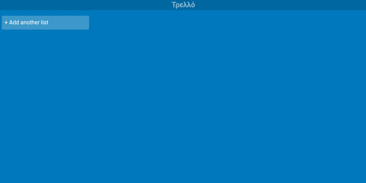

# A Trello Like app with Angular and GraphQL

## Stack

### Client

- Angular
- GraphQL w/ Apollog Client
- Angular CDK
- Bootstrap CSS
- Icons: https://feathericons.com/

### Server

- NodeJs
- Express
- Apollo Server
- MongoDB
- Mongoose

## Backlog

- Decide modal and clean up styles
- Set modal content
  - Update a task name
  - Update a project name
  - Set labels
  - Set description
